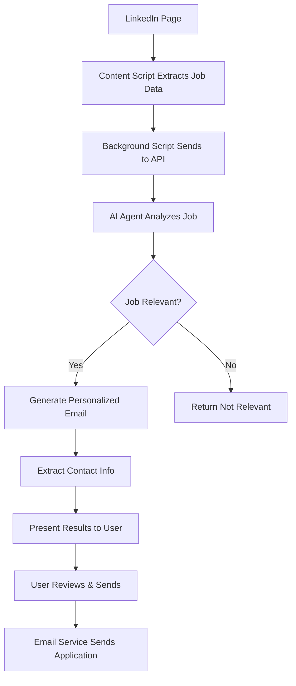

# 🤖 LinkedIn Job Assistant

An intelligent Chrome extension that automates LinkedIn job applications using AI-powered analysis and personalized email generation. Features a modern, accessible design system for consistent user experience.

## 🌟 Features

### 🎨 Modern Design System

- **Consistent UI**: Professional design language across all components
- **Dark/Light Mode**: Seamless theme switching with system preference detection
- **Accessibility First**: WCAG AA compliant with high contrast and reduced motion support
- **Responsive Design**: Optimized for all screen sizes and devices
- **Modern Aesthetics**: Clean gradients, smooth animations, and thoughtful spacing
- **Customizable**: Centralized color palette and design tokens for easy branding
- **Theme Toggle**: Easy switching between light and dark modes with visual feedback

### 🔍 Smart Job Analysis

- **Multi-AI Provider Support**: Uses OpenAI GPT models and Groq for enhanced analysis
- **Fallback Analysis**: Works without API keys using built-in logic
- **Real-time Detection**: Works on LinkedIn job pages and feed posts
- **Contextual Understanding**: Considers job requirements, company type, and location preferences
- **Skill Matching**: Analyzes job requirements against your profile

### ✉️ Automated Application Process

- **Personalized Emails**: Generates tailored application emails based on job content
- **Contact Extraction**: Automatically finds recruiter emails and contact information
- **One-Click Apply**: Send applications directly from the extension
- **Resume Attachment**: Automatically attaches your resume to applications

### ⚙️ Intelligent Customization

- **Secure AI Configuration**: Encrypted storage of API keys and settings
- **Profile-Based Filtering**: Matches jobs based on your skills, experience, and preferences
- **Smart Exclusions**: Filters out irrelevant roles (frontend, sales, etc.)
- **Location Preferences**: Considers remote/hybrid/on-site preferences
- **Company Type Filtering**: Focuses on startups, AI companies, or your preferred types
- **Environment Management**: Automatic .env file creation and management

### 📊 Application Tracking

- **Success Analytics**: Track application rates and success metrics
- **Job History**: Maintain a record of analyzed and applied jobs
- **Performance Insights**: Monitor which types of jobs get the best responses

## 🏗️ Architecture

### Frontend (Chrome Extension)

```
src/
├── styles/            # Modern design system
│   └── design-system.css # Core design tokens and utilities
├── utils/             # Shared utilities and configuration
│   └── config.js      # Design system configuration and backend URLs
├── background/        # Service worker for API communication
│   └── background.js
├── content/           # LinkedIn page interaction and parsing
│   ├── content.js     # Main content script
│   ├── content.css    # Styling for injected elements
│   └── linkedin-parser.js # LinkedIn page parsing logic
├── popup/             # Extension popup interface
│   ├── popup.html
│   ├── popup.js
│   └── popup.css
├── options/           # Settings and profile management
│   ├── options.html
│   ├── options.js
│   └── options.css
└── utils/             # Shared utilities
```

### Backend (Python Flask API)

```
backend/
├── app.py              # Main Flask application with all endpoints
├── .env                # Environment variables (auto-created)
├── requirements.txt    # Python dependencies
├── services/           # Business logic and AI services
│   ├── ai_agent.py     # Job analysis and email generation
│   └── ai_settings.py  # AI provider configuration management
├── utils/              # Backend utilities and core services
│   ├── env_manager.py  # Centralized environment management
│   ├── crypto.py       # Encryption/decryption for secure storage
│   └── __init__.py     # Package initialization
├── uploads/            # File uploads (resumes, etc.)
├── logs/               # Application logs
├── models/             # Data models (future database integration)
├── app/                # Additional app modules
└── venv/               # Python virtual environment
```

## 🚀 Quick Start

### Prerequisites

- **Node.js** (v14 or higher)
- **Python 3.8+**
- **Chrome Browser**
- **OpenAI API Key** (optional, for enhanced AI analysis)
- **Groq API Key** (optional, alternative AI provider)
- **Gmail Account** (for automatic email sending)

### 1. Clone and Setup

```bash
git clone https://github.com/heetdedakiya/ai-chrome-extension-tool.git
cd ai-chrome-extension-tool

# Run the automated setup script
./setup.sh
```

### 2. Configure Backend

```bash
cd backend
# Create and activate virtual environment
python -m venv venv
source venv/bin/activate  # On Windows: venv\Scripts\activate

# Install dependencies
pip install -r requirements.txt

# Configure environment (optional - .env will be auto-created)
cp .env.example .env
# Edit .env file with your configuration:
# - OPENAI_API_KEY (optional)
# - GROQ_API_KEY (optional, alternative to OpenAI)
# - EMAIL_ADDRESS and EMAIL_PASSWORD (for Gmail)
# - DEBUG=true (for development)
```

### 3. Start Backend Server

```bash
cd backend
source venv/bin/activate  # Activate virtual environment
python app.py
# Server will start on http://127.0.0.1:5000
```

### 4. Load Chrome Extension

1. Open Chrome and go to `chrome://extensions/`
2. Enable "Developer mode"
3. Click "Load unpacked" and select the project directory
4. The extension icon should appear in your toolbar

### 5. Configure Your Profile

1. Click the extension icon and go to Settings
2. Fill in your profile information
3. Set your job preferences and exclusions
4. Upload your resume

## 🎯 How It Works

### For Job Seekers (Like You!)

1. **Browse LinkedIn**: Navigate to LinkedIn job posts or your feed
2. **Analyze Jobs**: Click the floating "Analyze Job" button or use the extension popup
3. **Review Results**: See AI analysis of job relevance and generated application email
4. **Apply Instantly**: Copy email, open email client, or send automatically
5. **Track Progress**: Monitor your application statistics and success rate

### Technical Workflow



## 🎨 Theme System

### Dark/Light Mode Support

The extension features a comprehensive theme system with seamless switching between light and dark modes:

- **Automatic Detection**: Respects your system's color scheme preference
- **Manual Toggle**: Click the theme toggle button (🌙/☀️) in the popup or options page
- **Persistent Preference**: Your theme choice is saved and remembered
- **Professional Design**: Dark mode uses carefully selected colors for optimal readability
- **Consistent Experience**: Theme applies across all extension components

### Using the Theme Toggle

1. **In Popup**: Click the moon/sun icon in the header next to the settings button
2. **In Options**: Click the theme toggle in the top-right corner of the options page
3. **System Auto-Switch**: The extension automatically follows your system theme preference unless manually overridden

### Theme Demo

View the design system and test theme switching:

```bash
open src/styles/theme-demo.html
```

The demo showcases all UI components in both light and dark modes with real-time switching.

## 🔧 Configuration

### User Profile Setup

Configure your profile in the extension settings:

```javascript
{
  "name": "Your Name",
  "experience": 1,
  "domain": "Python Backend Development + AI/ML",
  "skills": ["Python", "Flask", "FastAPI", "TensorFlow"],
  "preferredRoles": ["Backend Developer", "AI/ML Engineer"],
  "preferredWorkType": ["Remote", "Hybrid"],
  "excludedRoles": ["Frontend", "Sales", "DevOps"],
  "preferredCompanyTypes": ["Tech startups", "AI-focused firms"]
}
```

### AI Configuration

The application supports multiple AI providers:

1. **OpenAI (Recommended)**:

   ```
   OPENAI_API_KEY=your_openai_api_key_here
   ```

2. **Groq (Alternative)**:

   ```
   GROQ_API_KEY=your_groq_api_key_here
   ```

3. **No API Key**: The system works without API keys using built-in analysis logic.

### Email Configuration

For automatic email sending, you'll need:

1. **Gmail App Password**:

   - Enable 2-factor authentication
   - Generate an app-specific password
   - Use this password (not your regular Gmail password)

2. **SMTP Settings**:
   ```
   SMTP_SERVER=smtp.gmail.com
   SMTP_PORT=587
   EMAIL_ADDRESS=mail.example@gmail.com
   EMAIL_PASSWORD=your_app_password
   DEBUG=true
   ```

## 🤖 AI Features

### Multi-Provider AI Support

The system supports multiple AI providers with automatic fallback:

1. **OpenAI Integration**: GPT-3.5-turbo and GPT-4 models for advanced analysis
2. **Groq Integration**: Fast inference with Mixtral and LLaMA models
3. **Built-in Fallback**: Works without API keys using keyword-based analysis

### Job Analysis Engine

The AI agent performs comprehensive analysis:

- **Content Understanding**: Parses job descriptions, requirements, and company information
- **Skill Matching**: Compares job requirements with your skill set using semantic analysis
- **Context Analysis**: Considers company culture, role level, and growth opportunities
- **Relevance Scoring**: Provides confidence scores for job matches
- **Technology Stack Detection**: Identifies programming languages, frameworks, and tools

### Email Generation

Generates personalized emails that:

- **Highlight Relevant Skills**: Mentions specific technologies from the job post
- **Show Genuine Interest**: References company-specific details and culture
- **Professional Tone**: Maintains appropriate formality and structure
- **Call to Action**: Includes clear next steps and contact information
- **Personalization**: Adapts content based on job level and company type

### Security Features

- **Encrypted Storage**: API keys and sensitive data encrypted using cryptography
- **Secure Key Management**: Master encryption key auto-generated and stored securely
- **Environment Protection**: Automatic .env file creation and management
- **Input Validation**: All user inputs validated and sanitized

### Example Generated Email

```
Subject: Application for AI/ML Developer Role - Your Name

Dear Hiring Team,

I came across your job posting for AI/ML Developer and I'm excited to apply.
As a Python Backend Developer and AI/ML Engineer with 1 year of industry experience,
I believe I would be a valuable addition to your team.

My technical expertise includes:
• Backend development using Python, Flask, and FastAPI
• AI/ML model development with TensorFlow and HuggingFace
• API development and integration

What particularly interests me about this role is the opportunity to work with
cutting-edge AI technologies. I'm passionate about building scalable systems
and implementing innovative ML solutions.

Please find my resume attached for your review.

Best regards,
Your Name
mail.example@gmail.com
+91-XXXXXXXXXX
```

## 📊 API Endpoints

### Job Analysis

```http
POST /api/analyze-job
Content-Type: application/json

{
  "job_data": {
    "title": "Backend Developer",
    "company": "Tech Startup",
    "description": "Python, Flask, AI/ML experience required...",
    "url": "https://linkedin.com/jobs/view/123456"
  },
  "user_profile": {
    "name": "Your Name",
    "skills": ["Python", "Flask", "TensorFlow"],
    "experience": 1,
    "domain": "Python Backend Development + AI/ML"
  }
}
```

### Email Sending

```http
POST /api/send-email
Content-Type: application/json

{
  "email": "recruiter@company.com",
  "subject": "Application for Backend Developer",
  "body": "Dear Hiring Team...",
  "attachment_path": "/path/to/resume.pdf"
}
```

### AI Settings Management

```http
POST /api/ai-settings
Content-Type: application/json

{
  "provider": "openai",
  "api_key": "your_api_key",
  "model": "gpt-3.5-turbo"
}
```

### Health Check

```http
GET /api/health
```

## 🛠️ Development

### Frontend Development

```bash
# Install dependencies
npm install

# Watch for changes and rebuild
npm run dev

# Build for production
npm run build

# Lint code
npm run lint

# Package extension
npm run pack
```

### Backend Development

```bash
cd backend
source venv/bin/activate

# Run in development mode (DEBUG=true in .env)
python app.py

# Test AI functionality
python demo_env_loading.py

# Run specific tests
python test_ai_settings.py

# Install new dependencies
pip install package_name
pip freeze > requirements.txt
```

### Extension Testing

1. Make changes to the code
2. Go to `chrome://extensions/`
3. Click the refresh icon on your extension
4. Test on LinkedIn pages

### Environment Management

The project includes automatic environment management:

- **Auto .env Creation**: The system automatically creates .env files with default values
- **Centralized Configuration**: All environment variables managed through `env_manager.py`
- **Type-Safe Access**: Environment variables accessed with proper type conversion
- **Security**: Sensitive data like API keys are encrypted and stored securely

### Testing

```bash
# Test environment loading
cd backend
python demo_env_loading.py

# Test AI settings
python test_ai_settings.py

# Test specific functionality
python -c "from services.ai_agent import analyze_job_post; print('AI Agent loaded successfully')"
```

## 🔒 Privacy & Security

### Data Handling

- **Local Storage**: All user data stored locally in browser and encrypted on backend
- **No Tracking**: No analytics or user behavior tracking
- **Secure Credentials**: API keys and email passwords encrypted using AES encryption
- **Minimal Permissions**: Extension only requests necessary LinkedIn access permissions
- **Auto-Generated Keys**: Cryptographic master keys automatically generated and stored securely

### Security Features

- **CORS Protection**: Backend properly configured for extension communication
- **Input Validation**: All user inputs validated and sanitized
- **Secure SMTP**: Email sending uses secure TLS connections
- **Encrypted Storage**: AI settings and sensitive data encrypted at rest
- **Environment Management**: Secure .env file handling with automatic creation
- **Key Rotation**: Support for updating and rotating encryption keys

## 🚧 Roadmap

### Phase 1 (Completed ✅)

- ✅ Basic job analysis and email generation
- ✅ Chrome extension with popup and content scripts
- ✅ Flask backend with multi-AI provider support
- ✅ Email sending functionality
- ✅ Secure environment management with auto .env creation
- ✅ Encrypted AI settings storage
- ✅ Multiple AI provider support (OpenAI, Groq)
- ✅ Fallback analysis without API keys

### Phase 2 (In Progress 🔄)

- 🔄 Enhanced UI/UX for extension interface
- 🔄 Advanced job filtering and categorization
- 🔄 Email template customization
- 🔄 Application tracking and analytics
- 🔄 Resume parsing and optimization

### Phase 3 (Planned 📅)

- 📅 Database integration for job history
- � Advanced analytics dashboard
- � LinkedIn API integration
- 📅 Company research integration
- 📅 Interview scheduling automation
- � Mobile companion app

## 🤝 Contributing

### Development Setup

1. Fork the repository
2. Create a feature branch: `git checkout -b feature/amazing-feature`
3. Make your changes and test thoroughly
4. Commit with descriptive messages: `git commit -m 'Add amazing feature'`
5. Push to your branch: `git push origin feature/amazing-feature`
6. Open a Pull Request

### Code Standards

- **Frontend**: ESLint configuration with Airbnb style guide
- **Backend**: PEP 8 Python style guide
- **Documentation**: Update README for new features
- **Testing**: Add tests for new functionality

## 📝 License

This project is licensed under the MIT License - see the [LICENSE](LICENSE) file for details.

## 👨‍💻 Author

**Your Name**

- Backend Developer & AI/ML Engineer
- 1 year industry experience
- Passionate about automation and AI

## 🙏 Acknowledgments

- OpenAI for GPT-3.5 API
- Chrome Extensions API documentation
- Flask community for excellent documentation
- LinkedIn for providing a platform to automate 😉

## 📞 Support

### Common Issues

#### Extension Not Working

1. Check if you're on a LinkedIn page
2. Refresh the extension in Chrome
3. Check browser console for errors
4. Ensure backend server is running

#### Email Not Sending

1. Verify email credentials in settings
2. Check Gmail App Password setup
3. Test email configuration in settings
4. Check backend logs for SMTP errors

#### AI Analysis Not Working

1. Check if AI provider API keys are configured (optional)
2. Verify backend server is accessible at http://127.0.0.1:5000
3. Check network connectivity and CORS settings
4. Review backend logs for detailed error messages
5. Fallback analysis should work even without API keys

### Getting Help

- 📧 Email: mail.example@gmail.com
- 🐛 Issues: Create a GitHub issue with detailed description
- 💬 Questions: Use GitHub Discussions
- 📚 Docs: Check the comprehensive documentation files in the repo

---

<div align="center">

**⭐ Star this repository if it helps you land your dream job! ⭐**

_Made with ❤️ for the developer community_

</div>
