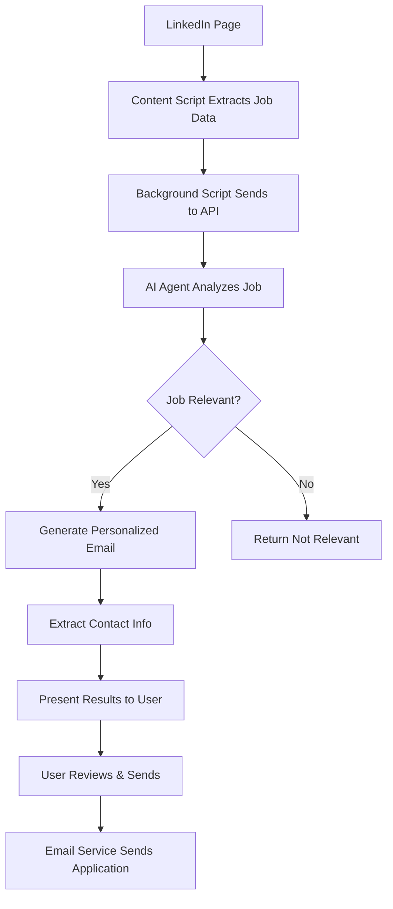

# 🤖 LinkedIn Job Assistant

An intelligent Chrome extension that automates LinkedIn job applications using AI-powered analysis and personalized email generation.

## 🌟 Features

### 🔍 Smart Job Analysis

- **AI-Powered Matching**: Automatically analyzes job posts to determine relevance to your profile
- **Real-time Detection**: Works on LinkedIn job pages and feed posts
- **Contextual Understanding**: Considers job requirements, company type, and location preferences

### ✉️ Automated Application Process

- **Personalized Emails**: Generates tailored application emails based on job content
- **Contact Extraction**: Automatically finds recruiter emails and contact information
- **One-Click Apply**: Send applications directly from the extension
- **Resume Attachment**: Automatically attaches your resume to applications

### ⚙️ Intelligent Customization

- **Profile-Based Filtering**: Matches jobs based on your skills, experience, and preferences
- **Smart Exclusions**: Filters out irrelevant roles (frontend, sales, etc.)
- **Location Preferences**: Considers remote/hybrid/on-site preferences
- **Company Type Filtering**: Focuses on startups, AI companies, or your preferred types

### 📊 Application Tracking

- **Success Analytics**: Track application rates and success metrics
- **Job History**: Maintain a record of analyzed and applied jobs
- **Performance Insights**: Monitor which types of jobs get the best responses

## 🏗️ Architecture

### Frontend (Chrome Extension)

```
src/
├── background/          # Service worker for API communication
├── content/            # LinkedIn page interaction and parsing
├── popup/              # Extension popup interface
├── options/            # Settings and profile management
└── utils/              # Shared utilities
```

### Backend (Python Flask API)

```
backend/
├── app.py              # Main Flask application
├── services/           # Business logic and AI services
│   └── ai_agent.py     # Job analysis and email generation
├── models/             # Data models (future database integration)
└── utils/              # Backend utilities
```

## 🚀 Quick Start

### Prerequisites

- **Node.js** (v14 or higher)
- **Python 3.8+**
- **Chrome Browser**
- **OpenAI API Key** (optional, for enhanced AI analysis)
- **Gmail Account** (for automatic email sending)

### 1. Clone and Setup

```bash
git clone https://github.com/heetdedakiya/ai-chrome-extension-tool.git
cd ai-chrome-extension-tool

# Run the automated setup script
./setup.sh
```

### 2. Configure Backend

```bash
cd backend
cp .env.example .env
# Edit .env file with your configuration:
# - OPENAI_API_KEY (optional)
# - EMAIL_ADDRESS and EMAIL_PASSWORD (for Gmail)
```

### 3. Start Backend Server

```bash
cd backend
source venv/bin/activate
python app.py
```

### 4. Load Chrome Extension

1. Open Chrome and go to `chrome://extensions/`
2. Enable "Developer mode"
3. Click "Load unpacked" and select the project directory
4. The extension icon should appear in your toolbar

### 5. Configure Your Profile

1. Click the extension icon and go to Settings
2. Fill in your profile information
3. Set your job preferences and exclusions
4. Upload your resume

## 🎯 How It Works

### For Job Seekers (Like You!)

1. **Browse LinkedIn**: Navigate to LinkedIn job posts or your feed
2. **Analyze Jobs**: Click the floating "Analyze Job" button or use the extension popup
3. **Review Results**: See AI analysis of job relevance and generated application email
4. **Apply Instantly**: Copy email, open email client, or send automatically
5. **Track Progress**: Monitor your application statistics and success rate

### Technical Workflow



## 🔧 Configuration

### User Profile Setup

Configure your profile in the extension settings:

```javascript
{
  "name": "Your Name",
  "experience": 1,
  "domain": "Python Backend Development + AI/ML",
  "skills": ["Python", "Flask", "FastAPI", "TensorFlow"],
  "preferredRoles": ["Backend Developer", "AI/ML Engineer"],
  "preferredWorkType": ["Remote", "Hybrid"],
  "excludedRoles": ["Frontend", "Sales", "DevOps"],
  "preferredCompanyTypes": ["Tech startups", "AI-focused firms"]
}
```

### Email Configuration

For automatic email sending, you'll need:

1. **Gmail App Password**:

   - Enable 2-factor authentication
   - Generate an app-specific password
   - Use this password (not your regular Gmail password)

2. **SMTP Settings**:
   ```
   SMTP_SERVER=smtp.gmail.com
   SMTP_PORT=587
   EMAIL_ADDRESS=your.email@gmail.com
   EMAIL_PASSWORD=your_app_password
   ```

## 🤖 AI Features

### Job Analysis Engine

The AI agent performs comprehensive analysis:

- **Content Understanding**: Parses job descriptions, requirements, and company information
- **Skill Matching**: Compares job requirements with your skill set
- **Context Analysis**: Considers company culture, role level, and growth opportunities
- **Relevance Scoring**: Provides confidence scores for job matches

### Email Generation

Generates personalized emails that:

- **Highlight Relevant Skills**: Mentions specific technologies from the job post
- **Show Genuine Interest**: References company-specific details
- **Professional Tone**: Maintains appropriate formality and structure
- **Call to Action**: Includes clear next steps and contact information

### Example Generated Email

```
Subject: Application for AI/ML Developer Role - Heet Dedakiya

Dear Hiring Team,

I came across your job posting for AI/ML Developer and I'm excited to apply.
As a Python Backend Developer and AI/ML Engineer with 1 year of industry experience,
I believe I would be a valuable addition to your team.

My technical expertise includes:
• Backend development using Python, Flask, and FastAPI
• AI/ML model development with TensorFlow and HuggingFace
• API development and integration

What particularly interests me about this role is the opportunity to work with
cutting-edge AI technologies. I'm passionate about building scalable systems
and implementing innovative ML solutions.

Please find my resume attached for your review.

Best regards,
Heet Dedakiya
heet.dedakiya@example.com
+91-XXXXXXXXXX
```

## 📊 API Endpoints

### Job Analysis

```http
POST /api/analyze-job
Content-Type: application/json

{
  "job_data": {
    "title": "Backend Developer",
    "company": "Tech Startup",
    "description": "Python, Flask, AI/ML experience required..."
  },
  "user_profile": {
    "name": "Heet Dedakiya",
    "skills": ["Python", "Flask", "TensorFlow"]
  }
}
```

### Email Sending

```http
POST /api/send-email
Content-Type: application/json

{
  "email": "recruiter@company.com",
  "subject": "Application for Backend Developer",
  "body": "Dear Hiring Team..."
}
```

## 🛠️ Development

### Frontend Development

```bash
# Watch for changes and rebuild
npm run dev

# Build for production
npm run build

# Lint code
npm run lint
```

### Backend Development

```bash
cd backend
source venv/bin/activate

# Run in development mode
FLASK_DEBUG=True python app.py

# Run tests
python -m pytest

# Install new dependencies
pip install package_name
pip freeze > requirements.txt
```

### Extension Testing

1. Make changes to the code
2. Go to `chrome://extensions/`
3. Click the refresh icon on your extension
4. Test on LinkedIn pages

## 🔒 Privacy & Security

### Data Handling

- **Local Storage**: All user data stored locally in browser
- **No Tracking**: No analytics or user behavior tracking
- **Secure Credentials**: Email passwords encrypted and stored securely
- **Minimal Permissions**: Extension only requests necessary permissions

### Security Features

- **CORS Protection**: Backend properly configured for extension communication
- **Input Validation**: All user inputs validated and sanitized
- **Secure SMTP**: Email sending uses secure TLS connections
- **Rate Limiting**: API endpoints protected against abuse

## 🚧 Roadmap

### Phase 1 (Current)

- ✅ Basic job analysis and email generation
- ✅ Chrome extension with popup and content scripts
- ✅ Flask backend with AI integration
- ✅ Email sending functionality

### Phase 2 (Planned)

- 🔄 Enhanced AI with GPT-4 integration
- 🔄 Database for job history and analytics
- 🔄 Multiple email templates
- 🔄 Company research integration

### Phase 3 (Future)

- 📅 Calendar integration for interview scheduling
- 📊 Advanced analytics dashboard
- 🔗 LinkedIn API integration
- 📱 Mobile companion app

## 🤝 Contributing

### Development Setup

1. Fork the repository
2. Create a feature branch: `git checkout -b feature/amazing-feature`
3. Make your changes and test thoroughly
4. Commit with descriptive messages: `git commit -m 'Add amazing feature'`
5. Push to your branch: `git push origin feature/amazing-feature`
6. Open a Pull Request

### Code Standards

- **Frontend**: ESLint configuration with Airbnb style guide
- **Backend**: PEP 8 Python style guide
- **Documentation**: Update README for new features
- **Testing**: Add tests for new functionality

## 📝 License

This project is licensed under the MIT License - see the [LICENSE](LICENSE) file for details.

## 👨‍💻 Author

**Heet Dedakiya**

- Backend Developer & AI/ML Engineer
- 1 year industry experience
- Passionate about automation and AI

## 🙏 Acknowledgments

- OpenAI for GPT-3.5 API
- Chrome Extensions API documentation
- Flask community for excellent documentation
- LinkedIn for providing a platform to automate 😉

## 📞 Support

### Common Issues

#### Extension Not Working

1. Check if you're on a LinkedIn page
2. Refresh the extension in Chrome
3. Check browser console for errors
4. Ensure backend server is running

#### Email Not Sending

1. Verify email credentials in settings
2. Check Gmail App Password setup
3. Test email configuration in settings
4. Check backend logs for SMTP errors

#### AI Analysis Not Working

1. Check OpenAI API key (if using enhanced mode)
2. Verify backend server is accessible
3. Check network connectivity
4. Fallback analysis should still work

### Getting Help

- 📧 Email: heet.dedakiya@example.com
- 🐛 Issues: Create a GitHub issue with detailed description
- 💬 Questions: Use GitHub Discussions

---

<div align="center">

**⭐ Star this repository if it helps you land your dream job! ⭐**

_Made with ❤️ for the developer community_

</div>
